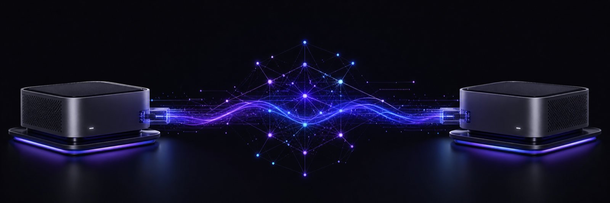
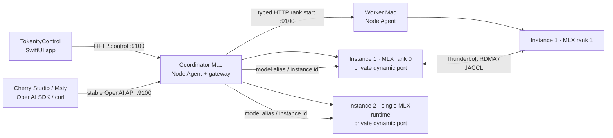

<p align="center">
  
</p>

<h1 align="center">Tokenity</h1>

<p align="center">
  A Mac-native control plane for running large MLX language models across multiple Apple-silicon machines.
</p>

<p align="center">
  
  
  
  
</p>

Tokenity combines a native SwiftUI application, lightweight Python node agents,
HTTP-based MLX rank orchestration, and an OpenAI-compatible inference server.
It is designed for local clusters where a model is too large for one Mac but can
fit across the combined unified memory of several machines.

> [!IMPORTANT]
> Tokenity is an early development project. The current stable baseline has been
> validated with a two-Mac Apple-silicon cluster, Thunderbolt RDMA/JACCL, and an
> MLX-formatted Qwen3.5 122B MoE model. Other topologies and model families may
> require additional work.

## Highlights

- Native macOS control app built with SwiftUI.
- Multi-Mac model loading through typed Node Agent HTTP commands; no SSH setup or password is required.
- Thunderbolt RDMA/JACCL, regular-network, and RDMA-with-fallback launch modes.
- Live readiness phases for distributed initialization, model loading, and generation.
- Model inventory with format, quantization, size, architecture, and shard metadata.
- GLM-5.2 cross-layer DSA indexer compatibility based on upstream mlx-lm PR #1410.
- Per-model runtime, thinking-mode, and sampling configuration with Qwen3.5 presets.
- Native Chat workspace with adaptive reasoning, Markdown and code rendering, per-message metrics, searchable history, follow-aware scrolling, and immediate cancellation.
- One streaming reconnect and non-streaming recovery only for explicit transport failures before the first token; protocol/server errors remain visible.
- Independent single- and multi-Mac model instances with per-instance ports, reservations, readiness quorum, request leases, and stable gateway routing.
- Model unload, cluster stop, and app shutdown cancel the active generation before backend teardown.
- OpenAI-compatible API for Cherry Studio, Msty, scripts, and other local clients.
- Node-level RDMA, memory, process, and model diagnostics.
- Reproducible Python and Swift verification in one command.

## How it works



The SwiftUI app talks to the coordinator's Node Agent. The coordinator starts
its local rank and asks every worker Agent to start a strictly typed rank over
HTTP. Each Agent supervises only its local process. Rank 0 hosts Tokenity's
OpenAI-compatible private server while MLX moves tensors over its ring or
JACCL/RDMA data plane. The Agent's stable gateway holds an instance request
lease and forwards SSE bytes without buffering. SSH is not part of product
startup or inference.

## Repository layout

```text
Tokenity/
├── apps/TokenityControl/   # Native SwiftUI macOS application
├── tokenity/               # Python package, CLI, node agent, and model server
│   ├── mlx/                # Hostfile, launcher, and RDMA probing
│   ├── node_agent/         # FastAPI node control service
│   ├── process/            # Role and process supervision
│   └── serving/            # Distributed OpenAI-compatible runtime
├── tests/                  # Python tests
├── scripts/                # Build, run, verify, and package helpers
└── docs/                   # Operations, API, installer, and baseline notes
```

## Requirements

### Controller Mac

- macOS 14 or newer.
- Apple silicon.
- Xcode Command Line Tools with Swift 5.9 or newer.
- Python 3.10 or newer for backend development.

### Inference Macs

- Apple-silicon Macs on the same trusted local network.
- A shared Tokenity/MLX runtime containing compatible `mlx`, `mlx-lm`, and
  distributed backend dependencies.
- The model available at the same path on every selected machine.
- Node Agent reachable on TCP port `9100`.
- For JACCL: a configured Thunderbolt link, RDMA devices, and peer IPs.

Tokenity's Python package intentionally does not install MLX-LM itself because
the validated cluster uses a separately managed shared runtime.

## Development setup

Clone the repository and install the Python development environment:

```bash
git clone git@github.com:HeyZhey/Tokenity.git
cd Tokenity

python3 -m venv .venv
source .venv/bin/activate
python -m pip install --upgrade pip
python -m pip install -e ".[dev]"
```

Run the complete baseline verification:

```bash
./scripts/verify-stable-baseline.sh
```

This runs the Python tests, Swift tests, and creates a fresh macOS `.app`
bundle. The resulting development app is placed below the Swift package's
`.build` directory.

## Run TokenityControl

Build and open the development app:

```bash
./scripts/run-tokenity-control-app.sh
```

Or build only:

```bash
./scripts/build-tokenity-control-app.sh
```

Install Tokenity on every participating Mac so launchd manages its Node Agent.
For single-Mac development only, an Agent can also be started manually:

```bash
tokenity node-agent --host 0.0.0.0 --port 9100
```

## UI workflow

1. Open **Cluster** and select the Macs that will participate.
2. Confirm both nodes report ready memory and RDMA/network state.
3. Use the recommended runtime: **Tokenity Distributed → Thunderbolt RDMA**.
4. Select **Create Cluster**.
5. Open **Models**, scan the shared model directory, and review its metadata.
6. Optionally open **Configure** to adjust runtime and generation settings.
7. Select **Load** and wait until the model state becomes **Loaded**.
8. Use **Chat**, or open **API Access** to connect another application.

## Menu Bar

TokenityControl remains available in the macOS menu bar after its main window is
closed. The menu uses the same `TokenityStore` instance as the main window and
continues a single low-frequency status monitor for the lifetime of the app.
Only **Quit Tokenity** exits the app; quitting safely cancels active generation,
stops model roles, and releases the cluster.

The status item combines color, shape, text, a tooltip, and accessibility labels:

| Appearance | Meaning |
| --- | --- |
| Gray circle | Server stopped and no inference service is running. |
| Yellow clock | Starting, loading, compiling, stopping, or waiting for a model/node. |
| Green check | Server readiness is `ready`, the model is loaded, every required Agent/rank is healthy, and world size plus connection mode match the launch configuration. |
| Red warning | Server/readiness failure, an offline required node, a failed rank, or inconsistent distributed topology. |
| Message activity symbol | A chat response is currently being generated; streamed tokens do not individually redraw the menu contents. |

The menu reports the listening endpoint, loaded model, single- or multi-Mac
inference mode, Native MTP mode, and generation activity. **Machines** contains a
submenu for every selected Controller and Worker with hostname, IP address,
Node Agent health, inference role, connection path, response latency/last response,
and a concise failure reason when available.

Available shortcuts are **Open Tokenity**, **Start Server**, **Stop Server**,
**Refresh Status**, **Open Models**, **Open Chat**, and **Quit Tokenity**. Unsafe or
duplicate operations are disabled with an explanatory line. Stopping from the
menu cancels an active streaming request before cleaning up all model roles.

Node Agent `/v1/node/info` and `/v1/node/status` responses include an optional,
backward-compatible `cluster_runtime` object with `cluster_id`, `rank`,
`world_size`, `connection_mode`, and `role`. The menu uses it to prevent a
partially connected distributed cluster from appearing healthy. After deploying
this version on each inference Mac, restart the system Agent so the resident
port-9100 process loads the new code:

```bash
sudo launchctl kickstart -k system/ai.tokenity.node-agent
```

Cluster settings expose these backends and connection modes:

| Setting | Purpose |
| --- | --- |
| Tokenity Distributed | Tokenity-managed distributed MLX inference; recommended. |
| Single Mac | Runs Tokenity on one selected Mac. |
| Thunderbolt RDMA | Dedicated high-throughput JACCL link; recommended for the validated two-Mac topology. |
| Standard Network | Regular network transport when RDMA is unavailable. |
| RDMA + Fallback | Prefer RDMA while retaining a standard-network path. |

## Model configuration

Configuration is stored per model and applied the next time that model is
loaded. Available controls include:

- Maximum output tokens — default `32768`, valid up to `262144`.
- Thinking mode — **Auto**, **On**, or **Off**. Qwen3.5 uses the tokenizer's
  `enable_thinking` chat-template switch, so disabling thinking does not rely on
  a natural-language instruction.
- Temperature, top-p, top-k, min-p, presence penalty, and repetition penalty.
- Official Qwen3.5 sampling presets are enabled by default: thinking uses
  `temperature=1.0`, `top_p=0.95`, `top_k=20`, `presence_penalty=1.5`; non-thinking
  uses `temperature=0.7`, `top_p=0.8`, `top_k=20`, `presence_penalty=1.5`.
  Sampling fields remain editable; changing any field automatically switches
  that model from the official preset to custom sampling.
- Prompt cache size.
- Prefill step size.
- Decode and prompt concurrency.
- Tokenizer remote-code trust.

The Models page can identify MLX, GGUF, and Transformers-style inventories,
but the distributed inference path currently validated by this project is MLX-LM.
Checkpoints whose `model_type` is `qwen3_5_mtp` are marked **Draft only** and
rejected by both the UI and Node Agent. These weights are speculative-decoding
draft weights, not standalone chat models.

Model parameter materialization uses an adaptive policy by default. Each
`mx.eval` batch is bounded by both 64 parameter leaves and 256 MiB of logical
tensor data, with no artificial per-batch sleep. This keeps small checkpoints
fast while bounding the working set for large checkpoints. Operators diagnosing
extreme memory pressure can opt back into the conservative fixed policy by
setting `TOKENITY_MLX_LOAD_POLICY=fixed`, together with
`TOKENITY_MLX_LOAD_EVAL_CHUNK_SIZE` and
`TOKENITY_MLX_LOAD_EVAL_SLEEP_SECONDS`.

## Chat

Tokenity Chat provides:

- A native macOS workspace with the transcript in the center, an auto-growing
  composer below it, model/connection/generation status in the header, and a
  searchable conversation sidebar on the right. The sidebar uses native list
  selection and keyboard navigation, groups sessions into Today, Yesterday,
  Previous 7 Days, Previous 30 Days, and Older, and supports rename/delete from
  each row's context menu.
- Streaming answer and `reasoning_content` rendering. Waiting for the first token
  is shown as a neutral generation state; a Thinking disclosure is created only
  after real reasoning arrives. Thinking is expanded while streaming, folds when
  the final answer begins, and then respects the user's manual disclosure choice.
- Incremental `<think>...</think>` parsing for models that place reasoning inside
  `content`, including tags split across SSE chunks. Incomplete tags are buffered
  so tag fragments never leak into the transcript and ordinary text is not lost.
- Native Markdown rendering for six heading levels, emphasis, strikethrough,
  nested ordered/unordered lists, quotes, dividers, inline code, links and detected
  URLs, tables, and fenced code blocks. Incomplete streaming Markdown remains
  visible while it is being completed; the original Markdown stays in the message
  model for copying, regeneration, and history restoration.
- Dedicated code blocks with language labels, lightweight highlighting for common
  languages, horizontal scrolling, preserved indentation, and copy confirmation.
  Unknown languages safely fall back to plain monospaced text. Code is never run.
- Per-assistant-message first-token time, total generation time, approximate token
  rate, model name, completion state, reasoning duration, and estimated reasoning
  tokens. Cancellation, repetition detection, errors, and output-token limits have
  distinct visible states.
- Follow-aware transcript scrolling: streaming follows only while the reader is at
  the bottom. Scrolling upward pauses follow mode and reveals a **Latest** button.
- Independent persistent conversation sessions loaded and encoded away from the
  main thread. New chat, stable selection, search, automatic titles, manual rename,
  neighbor selection after delete, and empty/loading states are built in.
- Return sends and Shift-Return inserts a newline. The native composer checks IME
  marked text before sending, grows to a bounded height, explains disabled states,
  and changes Send to Stop during generation.
- Message actions include copying original Markdown, editing a user turn,
  regenerating an assistant turn, and stopping the active response. They remain
  keyboard/VoiceOver accessible without permanently occupying transcript space.
- Protection against carrying incomplete or failed turns into the next prompt.
- A **Stop** control for active generation; unloading a model, stopping the cluster,
  or closing Tokenity also cancels the request immediately and excludes the
  incomplete turn from future context.
- A bounded SSE buffer with backpressure, preventing a fast producer from
  leaving stale tokens queued in the UI after cancellation.
- Coalesced token rendering (at most about 20 UI updates per second) so long
  reasoning streams do not monopolize the macOS main thread.
- Server- and client-side repeated-output detection. A cycling response is
  stopped automatically, its partial turn is excluded from future context, and
  the UI reports why generation ended.
- Automatic non-streaming fallback if the native streaming connection fails
  before any model output arrives.

## OpenAI-compatible API

When a model is loaded, the coordinator Node Agent exposes the stable
OpenAI-compatible gateway on port `9100`. The rank-0 runtime also listens on a
private backend port (typically `8000`) for diagnostics and gateway forwarding.

| Endpoint | Description |
| --- | --- |
| `GET /v1/models` | Available model identifiers. |
| `GET /v1/gateway/routes` | Ready model instances and routing metadata. |
| `POST /v1/chat/completions` | Streaming or non-streaming chat completions. |

Client configuration:

```text
Base URL: http://<coordinator-lan-ip>:9100/v1
API key:  tokenity-local  # placeholder only; authentication is currently disabled
Model:    use the id returned by GET /v1/models
```

Example:

```bash
TOKENITY_HOST=192.168.1.10
curl "http://${TOKENITY_HOST}:9100/v1/chat/completions" \
  -H 'Content-Type: application/json' \
  -d '{
    "model": "<model-id>",
    "messages": [{"role": "user", "content": "Hello from Tokenity"}],
    "max_tokens": 512,
    "stream": false
  }'
```

Browser-based local clients are supported through CORS. The API currently has
no authentication or TLS, so expose it only on a trusted network.

See [External API](docs/external-api.md) for Cherry Studio and Msty notes.

## CLI reference

```bash
tokenity --version
tokenity node-agent --host 0.0.0.0 --port 9100
tokenity rdma-probe --pretty
tokenity distributed-openai serve --model /path/to/model \
  --host 0.0.0.0 --port 8000
```

Use `tokenity <command> --help` for all arguments.

## Packaging

Build an ad-hoc development app bundle:

```bash
./scripts/build-tokenity-control-app.sh
```

Build a standard drag-to-Applications DMG:

```bash
./scripts/package-tokenity-dmg.sh
```

The DMG always contains `TokenityControl.app` and an Applications link. When a
Tokenity runtime source or cached runtime is available, it also contains a
separate **Install Tokenity Node Agent.pkg** for every Mac that will execute
models. Without a runtime, the script still produces a controller-only DMG.
Model weights are excluded by default. See [Installer DMG](docs/installer-dmg.md)
for runtime modes, signing, and verification details.

## Troubleshooting

### Models says Loaded but Chat cannot answer

Check the private rank-0 runtime directly:

```bash
TOKENITY_HOST=192.168.1.10
curl "http://${TOKENITY_HOST}:8000/health"
curl "http://${TOKENITY_HOST}:8000/v1/readiness"
curl "http://${TOKENITY_HOST}:8000/v1/models"
```

Current clients automatically fall back to a non-streaming completion when the
native stream fails before the first token. The Logs page records both the
stream error and fallback result.

### Model load never reaches Ready

- Confirm every selected node's Agent is reachable on `9100`.
- Confirm the model path exists on every Mac.
- Check the Node Agent's `distributed-openai` role and log path.
- Verify that all ranks use compatible Tokenity, Python, MLX, and MLX-LM versions.

### RDMA/JACCL initialization fails

```bash
tokenity rdma-probe --pretty
```

Then verify the configured Thunderbolt interfaces are active, the peer RDMA IP
is reachable, the expected `rdma_en*` device is active, and every Node Agent is
reachable over HTTP. A stale distributed process may also keep queue-pair resources
busy; stop the existing model role before launching it again.

## Documentation

- [Native MTP MVP](docs/native-mtp.md)

- [Stable baseline](docs/stable-baseline.md)
- [HTTP Node Agent protocol](docs/http-node-agent.md)
- [GLM-5.2 compatibility](docs/glm-5.2-compat.md)
- [External API](docs/external-api.md)
- [Current RDMA + Qwen operations](docs/current-usage-rdma-qwen.md)
- [Installer DMG](docs/installer-dmg.md)
- [Validated RDMA/Qwen status capture](docs/rdma-qwen-status-2026-07-08.md)

Some operational documents describe the original validated lab topology and
contain machine-specific examples. Adapt those values to your own cluster.

## Security and project status

- Product startup and inference never request or store SSH credentials.
- Node Agents expose typed lifecycle endpoints, not an arbitrary shell command endpoint.
- RDMA launch is blocked when required node/device metadata is missing.
- The external API is intended for a trusted local network.
- The legacy `mlx.launch` HTTP endpoint is disabled because it requires SSH for remote ranks.
- Automatic node discovery and a generic topology editor are not complete yet;
  the current UI includes the validated sample topology as its initial configuration.

No open-source license has been declared for this repository. All rights are
reserved unless the project owner adds a license in the future.
