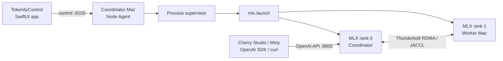

<p align="center">
  
</p>

<h1 align="center">Tokenity</h1>

<p align="center">
  A Mac-native control plane for running large MLX language models across multiple Apple-silicon machines.
</p>

<p align="center">
  
  
  
  
</p>

Tokenity combines a native SwiftUI application, lightweight Python node agents,
MLX distributed launch orchestration, and an OpenAI-compatible inference server.
It is designed for local clusters where a model is too large for one Mac but can
fit across the combined unified memory of several machines.

> [!IMPORTANT]
> Tokenity is an early development project. The current stable baseline has been
> validated with a two-Mac Apple-silicon cluster, Thunderbolt RDMA/JACCL, and an
> MLX-formatted Qwen3.5 122B MoE model. Other topologies and model families may
> require additional work.

## Highlights

- Native macOS control app built with SwiftUI.
- Multi-Mac model loading through `mlx.launch` and MLX distributed ranks.
- Thunderbolt RDMA/JACCL, regular-network, and RDMA-with-fallback launch modes.
- Live readiness phases for distributed initialization, model loading, and generation.
- Model inventory with format, quantization, size, architecture, and shard metadata.
- Per-model runtime and sampling configuration.
- Streaming Chat with expanded reasoning, automatic scrolling, metrics, and separate history sessions.
- Automatic non-streaming recovery when a macOS streaming connection fails before the first token.
- OpenAI-compatible API for Cherry Studio, Msty, scripts, and other local clients.
- Node-level RDMA, memory, process, and model diagnostics.
- Reproducible Python and Swift verification in one command.

## How it works



The SwiftUI app talks to the coordinator's Node Agent. The agent builds the
hostfile, starts and supervises the distributed process, and exposes status to
the UI. Rank 0 hosts Tokenity's OpenAI-compatible server while MLX distributes
model work across the selected Macs.

## Repository layout

```text
Tokenity/
├── apps/TokenityControl/   # Native SwiftUI macOS application
├── tokenity/               # Python package, CLI, node agent, and model server
│   ├── mlx/                # Hostfile, launcher, and RDMA probing
│   ├── node_agent/         # FastAPI node control service
│   ├── process/            # Role and process supervision
│   └── serving/            # Distributed OpenAI-compatible runtime
├── tests/                  # Python tests
├── scripts/                # Build, run, verify, and package helpers
└── docs/                   # Operations, API, installer, and baseline notes
```

## Requirements

### Controller Mac

- macOS 14 or newer.
- Apple silicon.
- Xcode Command Line Tools with Swift 5.9 or newer.
- Python 3.10 or newer for backend development.

### Inference Macs

- Apple-silicon Macs reachable over SSH.
- A shared Tokenity/MLX runtime containing compatible `mlx`, `mlx-lm`, and
  distributed backend dependencies.
- The model available at the same path on every selected machine.
- Node Agent reachable on TCP port `9100`.
- For JACCL: a configured Thunderbolt link, RDMA devices, peer IPs, and
  passwordless SSH between ranks.

Tokenity's Python package intentionally does not install MLX-LM itself because
the validated cluster uses a separately managed shared runtime.

## Development setup

Clone the repository and install the Python development environment:

```bash
git clone git@github.com:HeyZhey/Tokenity.git
cd Tokenity

python3 -m venv .venv
source .venv/bin/activate
python -m pip install --upgrade pip
python -m pip install -e ".[dev]"
```

Run the complete baseline verification:

```bash
./scripts/verify-stable-baseline.sh
```

This runs the Python tests, Swift tests, and creates a fresh macOS `.app`
bundle. The resulting development app is placed below the Swift package's
`.build` directory.

## Run TokenityControl

Build and open the development app:

```bash
./scripts/run-tokenity-control-app.sh
```

Or build only:

```bash
./scripts/build-tokenity-control-app.sh
```

Start a Node Agent manually on each participating Mac when it is not already
managed by the installer:

```bash
tokenity node-agent --host 0.0.0.0 --port 9100
```

## UI workflow

1. Open **Cluster** and select the Macs that will participate.
2. Confirm both nodes report ready memory and RDMA/network state.
3. Use the recommended runtime: **Tokenity Distributed → Thunderbolt RDMA**.
4. Select **Create Cluster**.
5. Open **Models**, scan the shared model directory, and review its metadata.
6. Optionally open **Configure** to adjust runtime and generation settings.
7. Select **Load** and wait until the model state becomes **Loaded**.
8. Use **Chat**, or open **API Access** to connect another application.

Advanced Cluster settings expose the other backends and connection modes:

| Setting | Purpose |
| --- | --- |
| Tokenity Distributed | Tokenity-managed distributed MLX inference; recommended. |
| Official MLX-LM | Compatibility path for the upstream server; experimental. |
| Single Mac | Runs Tokenity on one selected Mac. |
| Thunderbolt RDMA | Dedicated high-throughput JACCL link; recommended for the validated two-Mac topology. |
| Standard Network | Regular network transport when RDMA is unavailable. |
| RDMA + Fallback | Prefer RDMA while retaining a standard-network path. |

## Model configuration

Configuration is stored per model and applied the next time that model is
loaded. Available controls include:

- Maximum output tokens — default `32768`, valid up to `262144`.
- Temperature, top-p, top-k, and min-p sampling.
- Prompt cache size.
- Prefill step size.
- Decode and prompt concurrency.
- Tokenizer remote-code trust.

The Models page can identify MLX, GGUF, and Transformers-style inventories,
but the distributed inference path currently validated by this project is MLX-LM.

## Chat

Tokenity Chat provides:

- Streaming answer and `reasoning_content` rendering.
- Thinking expanded by default.
- Automatic transcript scrolling during generation.
- First-response time, total time, and approximate token rate.
- Independent persistent conversation sessions in a collapsible history sidebar.
- Protection against carrying incomplete or failed turns into the next prompt.
- Automatic non-streaming fallback if the native streaming connection fails
  before any model output arrives.

## OpenAI-compatible API

When a model is loaded, rank 0 exposes an API on port `8000`.

| Endpoint | Description |
| --- | --- |
| `GET /health` | Lightweight service health. |
| `GET /v1/readiness` | Detailed distributed runtime phase. |
| `GET /v1/models` | Available model identifiers. |
| `POST /v1/chat/completions` | Streaming or non-streaming chat completions. |
| `GET /v1/tokenity/info` | Tokenity service metadata and supported endpoints. |

Client configuration:

```text
Base URL: http://<coordinator-lan-ip>:8000/v1
API key:  tokenity-local  # placeholder only; authentication is currently disabled
Model:    use the id returned by GET /v1/models
```

Example:

```bash
TOKENITY_HOST=192.168.1.10
curl "http://${TOKENITY_HOST}:8000/v1/chat/completions" \
  -H 'Content-Type: application/json' \
  -d '{
    "model": "<model-id>",
    "messages": [{"role": "user", "content": "Hello from Tokenity"}],
    "max_tokens": 512,
    "stream": false
  }'
```

Browser-based local clients are supported through CORS. The API currently has
no authentication or TLS, so expose it only on a trusted network.

See [External API](docs/external-api.md) for Cherry Studio and Msty notes.

## CLI reference

```bash
tokenity --version
tokenity node-agent --host 0.0.0.0 --port 9100
tokenity rdma-probe --pretty
tokenity hostfile --connection jaccl --nodes-json nodes.json --pretty
tokenity distributed-openai launch-plan --model /path/to/model \
  --connection jaccl --nodes-json nodes.json --pretty
tokenity distributed-openai serve --model /path/to/model \
  --host 0.0.0.0 --port 8000
```

Use `tokenity <command> --help` for all arguments.

## Packaging

Build an ad-hoc development app bundle:

```bash
./scripts/build-tokenity-control-app.sh
```

Build the installer DMG using the configured runtime source:

```bash
./scripts/package-tokenity-dmg.sh
```

Model weights are excluded by default. Set `TOKENITY_INCLUDE_MODEL=1` only when
you intentionally need a very large offline installer. See
[Installer DMG](docs/installer-dmg.md) for runtime sources, signing, and
verification details.

## Troubleshooting

### Models says Loaded but Chat cannot answer

Check the service directly:

```bash
TOKENITY_HOST=192.168.1.10
curl "http://${TOKENITY_HOST}:8000/health"
curl "http://${TOKENITY_HOST}:8000/v1/readiness"
curl "http://${TOKENITY_HOST}:8000/v1/models"
```

Current clients automatically fall back to a non-streaming completion when the
native stream fails before the first token. The Logs page records both the
stream error and fallback result.

### Model load never reaches Ready

- Confirm every selected node's Agent is reachable on `9100`.
- Confirm the model path exists on every Mac.
- Check the Node Agent's `distributed-openai` role and log path.
- Verify that all ranks use compatible Tokenity, Python, MLX, and MLX-LM versions.

### RDMA/JACCL initialization fails

```bash
tokenity rdma-probe --pretty
```

Then verify the configured Thunderbolt interfaces are active, the peer RDMA IP
is reachable, the expected `rdma_en*` device is active, and SSH works over the
rank address. A stale distributed process may also keep queue-pair resources
busy; stop the existing model role before launching it again.

## Documentation

- [Stable baseline](docs/stable-baseline.md)
- [External API](docs/external-api.md)
- [Current RDMA + Qwen operations](docs/current-usage-rdma-qwen.md)
- [Installer DMG](docs/installer-dmg.md)
- [Validated RDMA/Qwen status capture](docs/rdma-qwen-status-2026-07-08.md)

Some operational documents describe the original validated lab topology and
contain machine-specific examples. Adapt those values to your own cluster.

## Security and project status

- SSH passwords are not stored in source, configuration, or logs.
- RDMA launch is blocked when required node/device metadata is missing.
- The external API is intended for a trusted local network.
- Official MLX-LM server mode remains experimental.
- Automatic node discovery and a generic topology editor are not complete yet;
  the current UI includes the validated sample topology as its initial configuration.

No open-source license has been declared for this repository. All rights are
reserved unless the project owner adds a license in the future.
