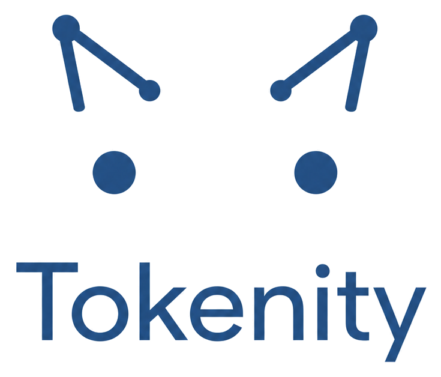
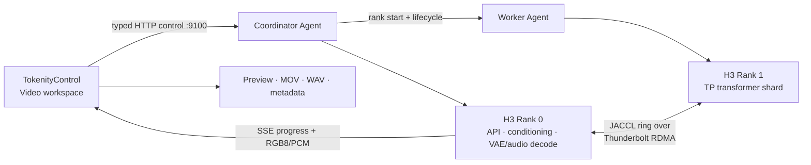
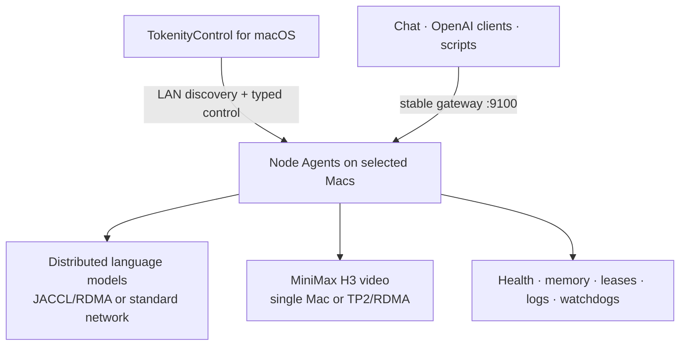

<p align="center">
  <picture>
    <source media="(prefers-color-scheme: dark)" srcset="apps/TokenityControl/Sources/TokenityControl/Resources/TokenityBrandLockupDark.png">
    <source media="(prefers-color-scheme: light)" srcset="apps/TokenityControl/Sources/TokenityControl/Resources/TokenityBrandLockup.png">
    
  </picture>
</p>

<p align="center">
  <strong>Distributed video generation and language inference for Apple-silicon Macs.</strong>
</p>

<p align="center">
  <strong>English</strong> · <a href="README.zh-CN.md">简体中文</a>
</p>

<p align="center">
  
  
  
  
  
</p>

# Tokenity

Tokenity turns Apple-silicon Macs on a local network into one managed AI
cluster. Its native macOS app discovers machines, validates the high-speed data
plane, starts distributed ranks, loads models, streams progress, and keeps the
whole workload lifecycle visible from one place.

The headline workload is **multi-Mac video generation**. Tokenity can split
MiniMax H3 across two Macs with block-wise tensor parallelism over Thunderbolt
RDMA/JACCL, so the machines cooperate on one generation instead of running two
independent copies of the model. The same control plane also runs distributed
language models, resident model pools, Chat, and an OpenAI-compatible API.

> [!IMPORTANT]
> Tokenity is an early-stage project for trusted local networks. The current
> hardware baseline covers single-Mac and two-Mac Apple-silicon workloads.
> MiniMax H3 TP2 and GLM 5.2 over JACCL/RDMA have been exercised on real
> hardware; other models and topologies depend on their MLX compatibility.

## Multi-Mac video generation

Tokenity makes distributed MiniMax H3 a first-class workflow in the macOS app:

1. Discover the coordinator and worker Mac and verify their stable machine
   identities, Agent versions, memory, model files, and RDMA devices.
2. Preflight the H3 checkpoint, TP2 manifest, rank shard hashes, native binary,
   protocol version, ports, and available disk space before starting either
   rank.
3. Launch Rank 0 and Rank 1 through typed Node Agent requests, wait for the
   JACCL data plane and complete `2/2` quorum, and roll back both ranks if
   startup fails.
4. Generate from the **Video** workspace with prompt, canvas, frame count,
   sampling steps, seed, and optimization controls while native SSE events
   drive live progress.
5. Preview the result in Tokenity and export a playable H.264 MOV with audio.
   Raw RGB video, PCM/WAV audio, and request metadata are retained alongside
   every completed result.

The Models page uses the same Load, progress, Cancel, and Stop lifecycle for
MiniMax H3 and language models. The Video page adds modality-specific runtime
configuration, generation controls, preview, export, and a compact list of the
five most recent results.

### One model, two cooperating Macs



This is **block-wise tensor parallelism**, not two full-model replicas. Rank 0
owns the public API, text encoder, initial latents, and final video/audio
decode. Rank 1 loads its transformer shard and participates in the 50 main DiT
blocks. A standard 28-step request performs 2,800 cross-rank collectives.

Each machine needs only its own `tp2/rank-N/transformer.safetensors` shard.
Rank 0 additionally owns the conditioning and decode components. A shared
versioned manifest pins both shards so Tokenity can reject mixed checkpoints,
binaries, protocols, or code revisions before they reach JACCL startup.

### Safe distributed lifecycle

- **Fail-closed startup** — a missing rank, incompatible Agent, inactive RDMA
  device, mismatched shard, or unsupported H3 protocol blocks launch with a
  structured diagnostic.
- **Quorum-aware health** — a surviving Rank 0 is never presented as Ready when
  Rank 1 has failed.
- **Collective-safe cancellation** — a disconnected TP2 request is drained in
  collective order so the ranks do not diverge; the runtime remains usable for
  the next request.
- **Instance-scoped stop** — stopping H3 targets its exact ranks and does not
  widen into a global cleanup that could kill a sibling language model.
- **Recovery and watchdogs** — PID start identity, operation identity, leases,
  ports, memory reservations, and rank evidence fence stale or orphaned work.

## Benchmark results

These are measured workload results from the validated two-Mac lab, not
vendor estimates. Both machines have 512 GiB of unified memory, and the TP2
runs use JACCL over Thunderbolt RDMA. Higher is better for language-model
throughput; lower is better for video-generation time. Results are specific to
this hardware, checkpoint, runtime, and topology.

### GLM 5.2 language inference

The formal run used one excluded 64-token warm-up followed by five sequential
streaming requests at temperature 0 and concurrency 1. Every measured request
used the same 40-token prompt and generated 256 completion tokens.

| Topology | Load result | Mean decode | p50 decode | Mean TTFT | p50 TTFT | Completed runs |
| --- | --- | ---: | ---: | ---: | ---: | ---: |
| Single Mac · 512 GiB | Blocked by safe admission | — | — | — | — | — |
| Two-Mac TP2 · 2 × 512 GiB | 2/2 ranks Ready | **23.28 tok/s** | **23.75 tok/s** | **1.63 s** | **2.06 s** | **5/5** |

The single-Mac launch was rejected before model startup because the
conservative requirement was 523.58 GB while only 394.59 GB was admissible on
the node. Tokenity did not bypass that safety check, so no misleading
single-Mac throughput is reported. In the TP2 run, each rank observed roughly
200 GB peak model memory; both ranks remained healthy through all five requests
and stopped cleanly afterward. The test used `GLM-5.2-mxfp4` with the
repository's [streaming benchmark harness](scripts/benchmark-openai-stream.py).

### MiniMax H3 video generation

The fixed request used `512×256`, 124 frames, 28 sampling steps, seed 42, and
`fast=false`. It completed through the Agent gateway with all RGB8 frames and
stereo PCM audio:

| Measurement | Single Mac | Two-Mac TP2 | Improvement |
| --- | ---: | ---: | ---: |
| DiT sampling | 301.891 s | 187.384 s | **1.611×** |
| End to end | 322.583 s | 204.512 s | **1.577×** |
| Video decode | 10.036 s | 9.976 s | Rank 0 only |
| Audio decode | 0.910 s | 0.835 s | Rank 0 only |

See [MiniMax H3 video](docs/minimax-h3-video.md) for the full protocol,
benchmark harness, fingerprints, and reproducibility notes.

## More than video

| Capability | What Tokenity provides |
| --- | --- |
| Distributed language models | Single- or multi-Mac MLX inference with coordinated rank startup, readiness, cancellation, and shutdown. |
| Resident model pool | Multiple isolated model instances can remain loaded, expose independent health, and share one stable gateway. |
| Automatic routing | Routes by requested model and policy while keeping explicit instance selection available. |
| Native Chat | Streaming answers, separated reasoning, conversation history, metrics, repetition protection, and immediate user cancellation. |
| OpenAI-compatible API | Streaming and non-streaming chat completions for local clients such as Cherry Studio, Msty, SDKs, and scripts. |
| Model intelligence | Scans model metadata, quantization, architecture, shards, and Native MTP capability instead of relying on folder-name allowlists. |
| Cluster discovery | Finds Node Agents on the LAN, tracks each Mac by stable `machine_id`, and repairs address changes without confusing remote nodes with loopback. |
| Operations | Memory admission, queues, timeouts, leases, health/readiness probes, resource ledgers, logs, watchdog restart, and upgrade-safe maintenance windows. |

Current model coverage includes GLM 5.2, Qwen-family MLX checkpoints, MiniMax
H3, and other compatible MLX models selected through metadata and runtime
capabilities. Native MTP activation is guarded by checkpoint and backend
evidence rather than model-name switches.

## Product architecture

Tokenity consists of three layers:

- **TokenityControl** — the native SwiftUI control plane for discovery,
  topology, Models, Chat, Video, API access, health, logs, settings, and repair.
- **Tokenity Node Agent** — a supervised HTTP service on every inference Mac.
  It owns local processes, resources, health evidence, instance journals, and
  watchdog integration.
- **Tokenity runtimes** — distributed MLX language inference and the native H3
  backend behind a stable gateway.



Agents start and supervise only local processes. Cross-machine orchestration
uses typed HTTP contracts; model collectives use the selected data plane.
Product startup and inference do not use SSH.

## Quick start

### 1. Install every participating Mac

Open the full Tokenity installer on each Mac. It installs Tokenity.app, the
Node Agent and watchdog, the pinned Python/MLX runtime, JACCL, and the native H3
runtime. Administrator approval is local to each machine.

Model weights are intentionally separate. Place compatible models under the
configured model root and keep the same logical model path on participating
language-model ranks. For H3 TP2, install the common manifest and the correct
rank shard on each Mac.

### 2. Build the cluster

1. Open **Cluster** and let LAN discovery find the Macs, or connect to an Agent
   URL directly.
2. Select the machines for the workload and review memory and network health.
3. Use Thunderbolt RDMA/JACCL when the direct link is Ready; standard-network
   modes remain available for compatible language workloads.
4. Create the cluster topology.

### 3. Generate video

1. Open **Models**, scan the selected Macs, and locate **MiniMax H3**.
2. Select **Load** and wait for topology validation, preflight, rank launch, and
   `2/2` readiness.
3. Select **Open Video**, enter a prompt, configure the canvas, frames, steps,
   seed, and optimization profile, then choose **Generate Video**.
4. Follow native progress, preview the result, and open, reveal, or share the
   saved movie.

### 4. Run a language model

1. Scan the shared language-model directory from **Models**.
2. Configure and load one or more compatible models.
3. Use **Chat**, automatic routing, or the external API.

## API

The coordinator exposes a stable gateway at:

```text
http://<coordinator-host>:9100/v1
```

Main endpoints:

- `GET /v1/models`
- `GET /v1/gateway/routes`
- `POST /v1/chat/completions`
- `POST /v1/video/generations`

Language example:

```bash
curl -N http://<coordinator-host>:9100/v1/chat/completions \
  -H 'Content-Type: application/json' \
  -d '{
    "model": "<model-id>",
    "messages": [{"role": "user", "content": "Explain tensor parallelism"}],
    "stream": true
  }'
```

Video example:

```bash
curl -N http://<coordinator-host>:9100/v1/video/generations \
  -H 'Content-Type: application/json' \
  -d '{
    "model": "MiniMax-H3",
    "prompt": "A cinematic tracking shot through a rain-soaked neon market",
    "width": 512,
    "height": 256,
    "num_frames": 124,
    "steps": 28,
    "seed": 42,
    "stream": true
  }'
```

Authentication and TLS are not enabled by default. Keep the gateway on a
trusted local network.

## Requirements

- Apple-silicon Macs on the same trusted network.
- The packaged runtime currently requires macOS 26.2 or newer.
- Swift 5.9+ for TokenityControl development and Python 3.10+ for backend
  development.
- TCP port `9100` reachable between TokenityControl and each Node Agent.
- Compatible model files on every participating Mac.
- For TP2 video and RDMA language inference: an active direct Thunderbolt link,
  supported RDMA devices, peer IPs, and matching JACCL/runtime components.

## Development and validation

```bash
git clone git@github.com:HeyZhey/Tokenity.git
cd Tokenity

python3 -m venv .venv
source .venv/bin/activate
python -m pip install -e ".[dev]"

./scripts/verify-stable-baseline.sh
```

Build and open the native app:

```bash
./scripts/run-tokenity-control-app.sh
```

Build the full installer after importing the validated runtime:

```bash
./scripts/package-tokenity-dmg.sh
```

Model weights are excluded by default. The current build is ad-hoc signed and
the pkg is unsigned; public distribution still requires Developer ID signing,
notarization, and stapling. See
[Installer and runtime distribution](docs/installer-dmg.md).

## Verification baseline

The local baseline covers Python and Swift tests plus a fresh app build. Real
distributed validation additionally requires matching Macs, runtimes,
checkpoints, and network hardware. The current hardware baseline includes:

- MiniMax H3 single-Mac and TP2/RDMA video generation, SSE progress, complete
  RGB8 + PCM output, coordinated stop, and repeatable output hashes.
- GLM 5.2 `2/2` JACCL/RDMA readiness, streaming and non-streaming completions,
  multi-turn chat, queues, cancellation, memory reclamation, and clean reload.
- Cross-workload RDMA/JACCL restart, Agent recovery, model inventory
  synchronization, and instance-scoped lifecycle behavior.

Run the baseline after changing MLX, MLX-LM, the H3 native binary, model
weights, Agent protocol, or distributed topology.

## Documentation

- [MiniMax H3 video](docs/minimax-h3-video.md)
- [Deployment configuration](docs/deployment-configuration.md)
- [Installer and runtime distribution](docs/installer-dmg.md)
- [HTTP Node Agent](docs/http-node-agent.md)
- [External API](docs/external-api.md)
- [GLM 5.2 compatibility](docs/glm-5.2-compat.md)
- [Native MTP](docs/native-mtp.md)
- [RDMA operations](docs/current-usage-rdma-qwen.md)
- [Stable baseline](docs/stable-baseline.md)

## Repository layout

```text
apps/TokenityControl/  Native SwiftUI application and tests
tokenity/              Python CLI, Node Agent, routing, and runtimes
tests/                 Python regression tests
scripts/               Build, verification, deployment, and packaging tools
docs/                  Operations, API, compatibility, and validation guides
```

## Security and license

Tokenity is designed for a trusted local network. The API currently has no
authentication or TLS, and the Node Agent should not be exposed to the public
internet. Product orchestration does not accept arbitrary shell commands and
does not store SSH credentials.

No open-source license has been declared for Tokenity. All rights are reserved.
See [Third-party notices](THIRD_PARTY_NOTICES.md) for separately licensed code.
