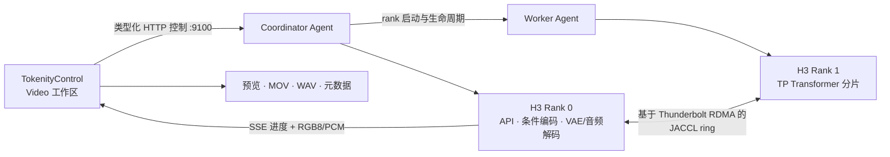
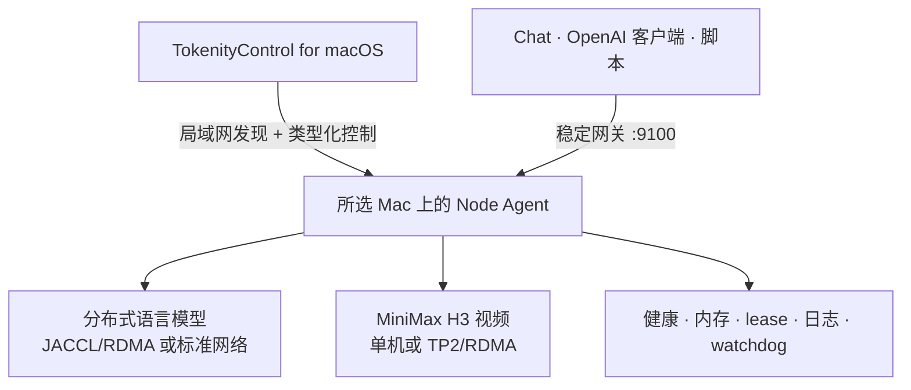

<p align="center">
  <picture>
    <source media="(prefers-color-scheme: dark)" srcset="apps/TokenityControl/Sources/TokenityControl/Resources/TokenityBrandLockupDark.png">
    <source media="(prefers-color-scheme: light)" srcset="apps/TokenityControl/Sources/TokenityControl/Resources/TokenityBrandLockup.png">
    
  </picture>
</p>

<p align="center">
  <strong>面向 Apple 芯片 Mac 的多机视频生成与语言模型推理平台。</strong>
</p>

<p align="center">
  <a href="README.md">English</a> · <strong>简体中文</strong>
</p>

<p align="center">
  
  
  
  
  
</p>

# Tokenity

Tokenity 将局域网内的 Apple 芯片 Mac 组成一个可管理的 AI 集群。原生 macOS
应用负责发现机器、检查高速数据面、启动分布式 rank、加载模型、显示实时进度，
并将工作负载的完整生命周期集中到一个控制面中。

Tokenity 当前最突出的能力是**多机视频生成**。它可以通过 Thunderbolt
RDMA/JACCL，以分块张量并行方式把 MiniMax H3 拆分到两台 Mac 上，让两台机器
共同完成一次生成，而不是分别运行两份完整模型。同一个控制面还可以运行分布式
语言模型、驻留模型池、原生 Chat 和 OpenAI 兼容 API。

> [!IMPORTANT]
> Tokenity 仍处于早期阶段，面向可信局域网。当前真实硬件基线覆盖 Apple 芯片
> 单机与双机工作负载；MiniMax H3 TP2 和 GLM 5.2 JACCL/RDMA 已完成实机验证，
> 其他模型与拓扑取决于对应的 MLX 兼容性。

## 多机视频生成

Tokenity 将分布式 MiniMax H3 做成了 macOS 应用中的一等工作流：

1. 发现 Coordinator 和 Worker Mac，检查稳定机器身份、Agent 版本、内存、
   模型文件与 RDMA 设备。
2. 在启动任一 rank 前，预检 H3 checkpoint、TP2 manifest、rank 分片哈希、
   原生二进制、协议版本、端口和可用磁盘空间。
3. 通过类型化 Node Agent 请求启动 Rank 0 与 Rank 1，等待 JACCL 数据面和完整
   `2/2` quorum；任何一步失败都会回滚两个 rank。
4. 在 **Video** 页面配置提示词、画布、帧数、采样步数、种子和优化选项，原生
   SSE 事件会持续更新生成进度。
5. 直接在 Tokenity 中预览，并导出带声音、可播放的 H.264 MOV；每个完成结果还
   会保留原始 RGB 视频、PCM/WAV 音频和请求元数据。

Models 页面为 MiniMax H3 和语言模型提供一致的 Load、进度、Cancel 和 Stop
生命周期；Video 页面在此基础上增加视频 Runtime 配置、生成参数、预览、导出，
以及精简的最近 5 个结果列表。

### 一个模型，两台协作的 Mac



这是**分块张量并行**，不是两份完整模型副本。Rank 0 负责公共 API、文本编码器、
初始 latent 和最终视频/音频解码；Rank 1 加载自己的 Transformer 分片，并参与
50 个主要 DiT block。一次标准 28-step 请求会执行 2,800 次跨 rank collective。

每台机器只需要自己的 `tp2/rank-N/transformer.safetensors` 分片；Rank 0 还需要
条件编码与解码组件。公共版本化 manifest 会固定两个分片，使 Tokenity 能在进入
JACCL 启动前拒绝混用的 checkpoint、二进制、协议或代码版本。

### 安全的分布式生命周期

- **失败即关闭** —— rank 缺失、Agent 不兼容、RDMA 未激活、分片不一致或 H3
  协议不受支持时，启动会被阻止并返回结构化诊断。
- **Quorum 感知健康状态** —— Rank 1 失败后，单独存活的 Rank 0 不会被错误显示
  为 Ready。
- **Collective 安全取消** —— TP2 客户端断开后，当前请求会按 collective 顺序
  完成清理，防止两个 rank 状态分叉，并保证下一次请求仍可继续使用。
- **实例级停止** —— 停止 H3 只会操作它对应的 rank，不会扩大成可能误杀其他
  语言模型的全局清理。
- **恢复与 watchdog** —— PID 启动身份、operation identity、lease、端口、内存
  预留和 rank 证据共同隔离过期或孤儿工作负载。

## Benchmark 评测结果

以下数据来自已验证的双机实验环境，是实际测量结果而不是厂商估算。两台机器均配备
512 GiB 统一内存，TP2 通过 Thunderbolt RDMA 使用 JACCL。语言模型吞吐越高越好，
视频生成耗时越低越好；结果仅代表本次硬件、checkpoint、Runtime 与网络拓扑。

### GLM 5.2 语言模型推理

正式测试先执行一次不计入结果的 64-token 预热，然后以 temperature 0、并发数 1
连续完成 5 次流式请求。每次正式请求使用相同的 40-token prompt，并生成 256 个
completion token。

| 拓扑 | 加载结果 | 平均解码速度 | p50 解码速度 | 平均 TTFT | p50 TTFT | 完成次数 |
| --- | --- | ---: | ---: | ---: | ---: | ---: |
| 单机 · 512 GiB | 1/1 Runtime Ready · 受控配置 | **19.39 tok/s** | **19.70 tok/s** | **4.02 s** | **5.22 s** | **5/5** |
| 双机 TP2 · 2 × 512 GiB | 2/2 ranks Ready | **23.28 tok/s** | **23.75 tok/s** | **1.63 s** | **2.06 s** | **5/5** |

单机数据使用受控的 512-token Runtime 配置，包含 1 份 prompt cache 和 128-token
prefill 分块；每次正式请求仍与 TP2 一样使用相同的 40-token prompt 和 256-token
输出。Runtime 完整达到 `1/1` Ready，观测到的 MLX 模型常驻内存为 395.09 GB。
Tokenity 的常规 4K 单机配置仍会被保守安全准入阻止（需要 523.58 GB，可准入
394.59 GB），因此该受控配置仅用于 Benchmark，并未替换产品默认值。双机 TP2
测试中，每个 rank 观测到的模型内存峰值约为 200 GB。全部请求均完成，测试后所有
进程、端口与内存预留均已释放。测试模型为 `GLM-5.2-mxfp4`，使用仓库内的
[流式 Benchmark 工具](scripts/benchmark-openai-stream.py)。

### MiniMax H3 视频生成

2026-08-26 的配对 cold 测试固定使用 `512×256`、124 帧、28 个采样步、
seed 42 和 `fast=false`：

| 拓扑 / 对比 | Cold DiT 采样 | 相对结果 |
| --- | ---: | ---: |
| 单机 · 512 GiB | 316.203 s | 1.000× 基线 |
| 双机 TP2 · 2 × 512 GiB | 181.385 s | **1.743× 加速** |
| TP2 提升 | **节省 134.818 s** | **耗时减少 42.6%** |

两个请求均完成全部 28 个去噪步骤，并返回 124 帧 RGB8 视频与立体声 PCM 音频。
TP2 通过 Thunderbolt RDMA 使用 JACCL；两个 rank 最终均以 code 0 退出，且端口
和内存预留均已释放。

完整协议、基准工具、指纹和复现说明请参阅
[MiniMax H3 视频](docs/minimax-h3-video.md)。

## 不止视频

| 能力 | Tokenity 提供的功能 |
| --- | --- |
| 分布式语言模型 | 单机或多机 MLX 推理，包含协调的 rank 启动、readiness、取消和关闭。 |
| 驻留模型池 | 多个隔离模型实例可以同时驻留，独立报告健康状态，并共享稳定网关。 |
| 自动路由 | 按请求模型与策略选择实例，同时保留显式指定实例的能力。 |
| 原生 Chat | 流式回答、独立思考内容、会话历史、性能指标、重复保护和即时中止。 |
| OpenAI 兼容 API | 为 Cherry Studio、Msty、SDK 和脚本提供流式/非流式 Chat Completions。 |
| 模型识别 | 扫描模型元数据、量化、架构、分片和 Native MTP 能力，不依赖目录名白名单。 |
| 集群发现 | 自动发现局域网 Agent，通过稳定 `machine_id` 跟踪 Mac，并在地址变化后修复连接。 |
| 运行维护 | 内存准入、队列、超时、lease、健康/readiness、资源账本、日志、watchdog 和升级维护窗口。 |

当前模型覆盖包括 DeepSeek V4、GLM 5.2、Qwen 系列 MLX checkpoint、MiniMax H3，
以及其他由元数据与 Runtime 能力确认兼容的 MLX 模型。Native MTP 也依据
checkpoint 和后端证据安全启用，而不是写死模型名称。

## 产品架构

Tokenity 由三层组成：

- **TokenityControl** —— 原生 SwiftUI 控制面，包含发现、拓扑、Models、Chat、
  Video、API Access、健康状态、日志、设置与修复。
- **Tokenity Node Agent** —— 部署在每台推理 Mac 上的受控 HTTP 服务，负责本机
  进程、资源、健康证据、实例日志和 watchdog 集成。
- **Tokenity runtimes** —— 通过稳定网关提供分布式 MLX 语言推理与原生 H3 后端。



Agent 只启动和监管本机进程；跨机编排使用类型化 HTTP 契约，模型 collective
使用所选数据面。产品启动与推理路径不使用 SSH。

## 快速开始

### 1. 安装所有参与的 Mac

在每台 Mac 上打开完整 Tokenity 安装包。它会安装 Tokenity.app、Node Agent、
watchdog、固定版本的 Python/MLX Runtime、JACCL 和原生 H3 Runtime。管理员授权
只在各台机器本地进行。

模型权重不会包含在安装包中。请将兼容模型放入配置的模型根目录，并确保参与语言
模型推理的机器使用相同逻辑路径。H3 TP2 需要在两台 Mac 上放置公共 manifest
和各自正确的 rank 分片。

### 2. 创建集群

1. 打开 **Cluster**，由局域网发现自动找到 Mac，也可以直接连接 Agent URL。
2. 选择参与工作负载的机器，检查内存与网络状态。
3. 直连链路 Ready 时使用 Thunderbolt RDMA/JACCL；兼容的语言模型也可以选择
   标准网络模式。
4. 创建集群拓扑。

### 3. 生成视频

1. 打开 **Models**，扫描所选 Mac，找到 **MiniMax H3**。
2. 选择 **Load**，等待拓扑验证、预检、rank 启动和 `2/2` Ready。
3. 选择 **Open Video**，输入提示词，设置画布、帧数、步数、种子和优化配置，
   然后选择 **Generate Video**。
4. 查看原生进度，预览生成结果，并打开、在 Finder 中显示或分享保存的视频。

### 4. 运行语言模型

1. 在 **Models** 中扫描所有节点共有的语言模型目录。
2. 配置并加载一个或多个兼容模型。
3. 使用 **Chat**、自动路由或外部 API。

## API

Coordinator 通过以下地址提供稳定网关：

```text
http://<coordinator-host>:9100/v1
```

主要接口：

- `GET /v1/models`
- `GET /v1/gateway/routes`
- `POST /v1/chat/completions`
- `POST /v1/video/generations`

语言模型示例：

```bash
curl -N http://<coordinator-host>:9100/v1/chat/completions \
  -H 'Content-Type: application/json' \
  -d '{
    "model": "<model-id>",
    "messages": [{"role": "user", "content": "解释一下张量并行"}],
    "stream": true
  }'
```

视频生成示例：

```bash
curl -N http://<coordinator-host>:9100/v1/video/generations \
  -H 'Content-Type: application/json' \
  -d '{
    "model": "MiniMax-H3",
    "prompt": "A cinematic tracking shot through a rain-soaked neon market",
    "width": 512,
    "height": 256,
    "num_frames": 124,
    "steps": 28,
    "seed": 42,
    "stream": true
  }'
```

默认不启用身份认证和 TLS，请只在可信局域网中开放网关。

## 运行要求

- 位于同一可信网络的 Apple 芯片 Mac。
- 当前打包 Runtime 要求 macOS 26.2 或更高版本。
- TokenityControl 开发需要 Swift 5.9+，后端开发需要 Python 3.10+。
- TokenityControl 可以访问每个 Node Agent 的 TCP `9100` 端口。
- 每台参与机器上具有兼容的模型文件。
- TP2 视频和 RDMA 语言推理需要活动的 Thunderbolt 直连、受支持的 RDMA 设备、
  对端 IP，以及匹配的 JACCL/Runtime 组件。

## 开发与验证

```bash
git clone git@github.com:HeyZhey/Tokenity.git
cd Tokenity

python3 -m venv .venv
source .venv/bin/activate
python -m pip install -e ".[dev]"

./scripts/verify-stable-baseline.sh
```

构建并打开原生应用：

```bash
./scripts/run-tokenity-control-app.sh
```

导入已验证 Runtime 后构建完整安装包：

```bash
./scripts/package-tokenity-dmg.sh
```

模型权重默认不包含在安装包中。当前 App 使用 ad-hoc 签名，pkg 尚未签名；公开
分发仍需要 Developer ID 签名、公证和 stapling。详见
[安装与 Runtime 分发](docs/installer-dmg.md)。

## 验证基线

本地基线覆盖 Python、Swift 测试和全新 App 构建。真实分布式验收还需要匹配的
Mac、Runtime、checkpoint 与网络硬件。当前硬件基线包括：

- MiniMax H3 单机和 TP2/RDMA 视频生成、SSE 进度、完整 RGB8 + PCM 输出、
  协调停止和可重复的产物哈希。
- GLM 5.2 `2/2` JACCL/RDMA readiness、流式与非流式完成、多轮对话、队列、
  中止、内存回收和干净重载。
- 跨工作负载 RDMA/JACCL 重启、Agent 恢复、模型清单同步和实例级生命周期。

修改 MLX、MLX-LM、H3 原生二进制、模型权重、Agent 协议或分布式拓扑后，必须
重新运行基线验证。

## 文档

- [MiniMax H3 视频](docs/minimax-h3-video.md)
- [部署配置](docs/deployment-configuration.md)
- [安装与 Runtime 分发](docs/installer-dmg.md)
- [HTTP Node Agent](docs/http-node-agent.md)
- [外部 API](docs/external-api.md)
- [DeepSeek V4 兼容性](docs/deepseek-v4-compat.md)
- [GLM 5.2 兼容性](docs/glm-5.2-compat.md)
- [Native MTP](docs/native-mtp.md)
- [RDMA 操作](docs/current-usage-rdma-qwen.md)
- [稳定基线](docs/stable-baseline.md)

## 仓库结构

```text
apps/TokenityControl/  原生 SwiftUI 应用和测试
tokenity/              Python CLI、Node Agent、路由和 Runtime
tests/                 Python 回归测试
scripts/               构建、验证、部署和打包工具
docs/                  操作、API、兼容性和验证文档
```

## 安全与许可

Tokenity 面向可信局域网。API 当前没有身份认证和 TLS，不应将 Node Agent 暴露到
公网。产品编排不接受任意 shell 命令，也不会保存 SSH 凭据。

Tokenity 尚未声明开源许可证，保留所有权利。采用独立许可证的代码参见
[第三方声明](THIRD_PARTY_NOTICES.md)。
