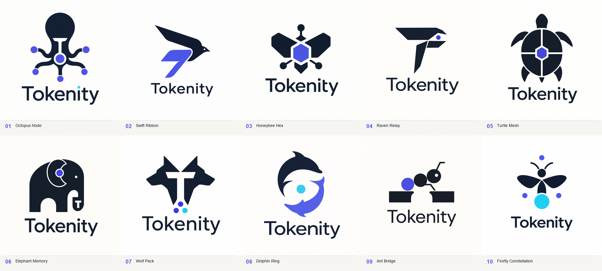

# Tokenity logo concepts

These ten ImageGen explorations pair a restrained animal silhouette with
Tokenity's core product ideas: distributed nodes, unified memory, fast token
flow, and reliable local inference.

| No. | Concept | Product metaphor |
| --- | --- | --- |
| 01 | Octopus Node | One coordinator guiding several distributed workers |
| 02 | Swift Ribbon | Low-latency token flow and native Swift craftsmanship |
| 03 | Honeybee Hex | Many machines cooperating as one cluster |
| 04 | Raven Relay | Intelligent routing and passing work between nodes |
| 05 | Turtle Mesh | Stable, dependable, long-running local inference |
| 06 | Elephant Memory | Large unified memory and calm compute power |
| 07 | Wolf Pack | Coordinated workers, precision, and trust |
| 08 | Dolphin Ring | Fast bidirectional streaming and cooperative flow |
| 09 | Ant Bridge | Lightweight agents combining into strong infrastructure |
| 10 | Firefly Constellation | Active generation and nodes illuminating one result |

## Shared ImageGen direction

- Use case: `logo-brand`
- Asset: square concept board for a Mac-native distributed AI product
- Layout: one centered symbol above the exact wordmark `Tokenity`
- Style: crisp vector-like flat geometry, Swiss-modern restraint, strong
  silhouette, intelligent rather than playful
- Palette: midnight graphite `#111827`, electric indigo `#5B5CE2`, and an
  optional small cyan `#22D3EE` accent
- Constraints: original design, balanced negative space, readable at 24 px,
  maximum three colors, no mockup, gradient, shadow, glow, 3D, photographic
  texture, slogan, watermark, app-icon container, Apple logo, or circuit-board
  cliché

## Concept-specific prompts

1. **Octopus Node:** a front-on, highly simplified octopus whose bold tentacle
   curves end in node dots around a central token, with a subtle `T` in negative
   space.
2. **Swift Ribbon:** an abstract swift in forward flight, built from two
   interlocking flat ribbons that suggest a flowing token stream and a subtle
   `T`.
3. **Honeybee Hex:** a minimal top-view bee made from a central hexagonal token,
   mirrored wings, and three discreet node points.
4. **Raven Relay:** a compact raven made from three angular planes, passing one
   circular token from beak to wing while the silhouette quietly forms a `T`.
5. **Turtle Mesh:** a top-view turtle with one geometric shell divided into
   several connected cells around a central token.
6. **Elephant Memory:** a continuous elephant profile whose ear contains a
   central token and whose trunk curls into a restrained `T`.
7. **Wolf Pack:** two mirrored wolf profiles creating a central `T` in negative
   space, supported by three small cluster nodes.
8. **Dolphin Ring:** two smooth dolphin crescents orbiting one central token to
   suggest a nearly closed, bidirectional flow.
9. **Ant Bridge:** a side-profile ant made from exactly three token forms,
   crossing a simple gap formed by negative space.
10. **Firefly Constellation:** a compact firefly with a flat cyan token abdomen,
    symmetric wings, and three surrounding node dots.

These PNGs are concept explorations, not production vector masters. A selected
direction should be redrawn as clean SVG geometry, optically balanced, checked
in one color, and tested at favicon and macOS app-icon sizes.
