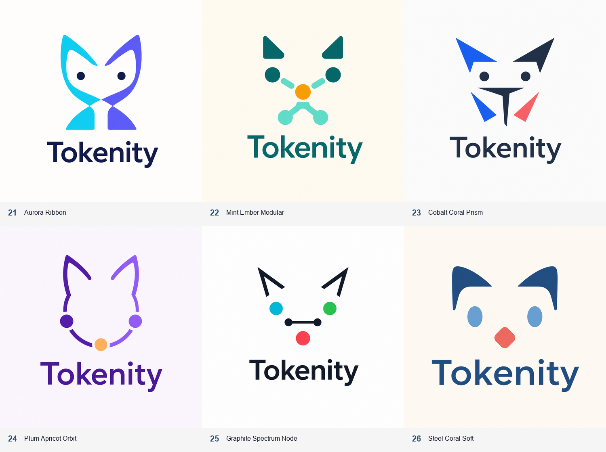

# Tokenity cat color and shape exploration

Six ImageGen concepts explore different color systems and geometric languages.
The supplied cat image is treated as a loose conceptual reference only: the
mark should remain recognizable with very few shapes.

| No. | Direction | Palette | Shape language |
| --- | --- | --- | --- |
| 21 | Aurora Ribbon | Navy, cyan, indigo | Two crossing ribbons create a cat and imply bidirectional token flow |
| 22 | Mint Ember Modular | Deep teal, mint, amber | Rounded modules turn the face into a distributed cluster |
| 23 | Cobalt Coral Prism | Slate, cobalt, coral | Angular planes and a central `T` create a precise, technical mask |
| 24 | Plum Apricot Orbit | Plum, violet, apricot | Open arcs and token nodes suggest circulation around shared memory |
| 25 | Graphite Spectrum Node | Graphite with cyan, green, amber, coral nodes | Sparse status nodes form the face through spacing alone |
| 26 | Steel Coral Soft | Steel blue, sky, coral | Broad rounded shapes feel calm, native, and approachable |

## Recommended shortlist

1. **21 Aurora Ribbon** — strongest standalone brand silhouette and the clearest
   sense of flow.
2. **22 Mint Ember Modular** — best expression of coordinator, workers, and a
   connected compute fabric.
3. **24 Plum Apricot Orbit** — friendliest direction without becoming a pet
   mascot.

## Shared ImageGen direction

Create an original minimal multicolor cat-inspired Tokenity logo for a
Mac-native distributed AI control plane. Preserve only the reference image's
principle that a cat can be recognized from very few marks; freely vary ear,
eye, node, connection, curvature, symmetry, and negative-space geometry. Place
one centered symbol above the exact wordmark `Tokenity`. Use two to four
deliberate flat colors whose roles communicate structure, worker nodes, and a
coordinator or token focal point. Keep a strong silhouette, balanced negative
space, and 16–24 px readability. Avoid random decoration, gradients, shadows,
glow, texture, 3D, full-body cats, detailed faces, extra text, app-icon
containers, and circuit-board clichés.

These are raster concept boards. A selected design should be reconstructed as
flat, optically corrected SVG geometry and checked in full color, one color,
light mode, and dark mode.
