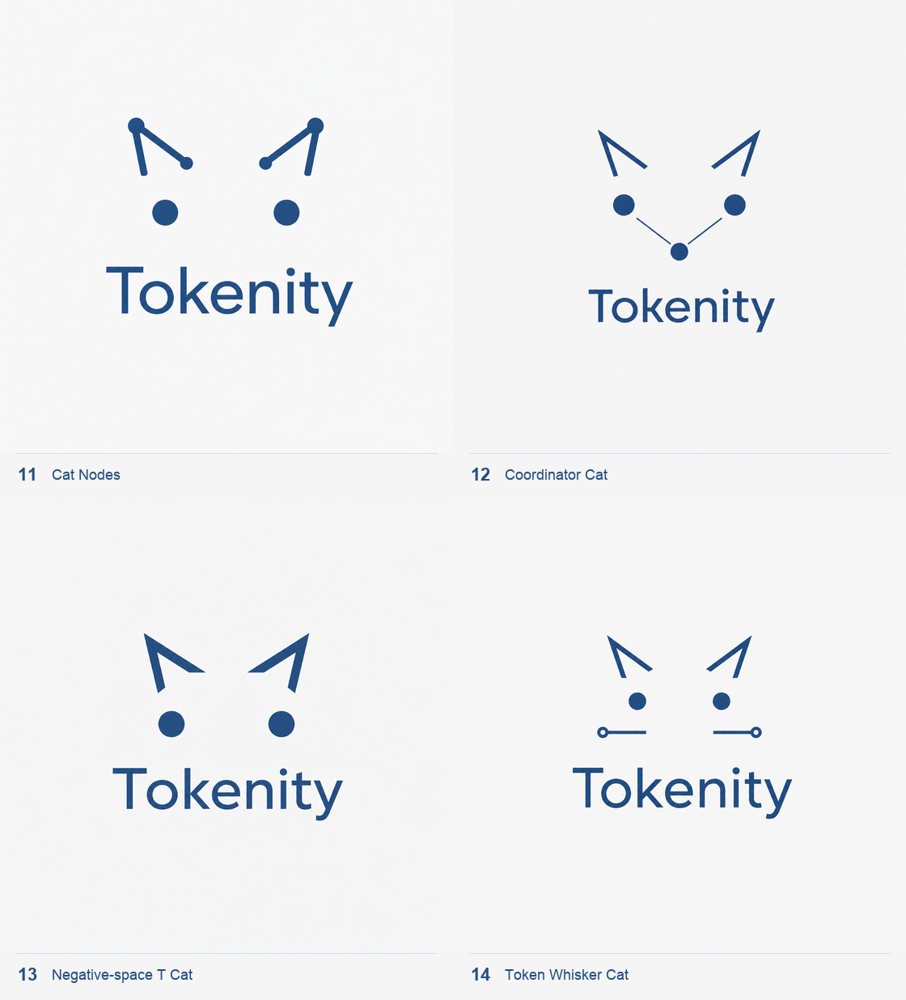

# Tokenity cat direction

This ImageGen exploration uses the supplied image only as a style and color
reference: an implied cat face made from two open angular ears and two circular
eyes, with no enclosing head outline.

## Palette

- Primary steel blue: `#244F81`
- Soft off-white background: `#F5F5F5`
- Optional light node accent for later refinement: `#4F8FCB`

## Directions

| No. | Direction | Intent |
| --- | --- | --- |
| 11 | Cat Nodes | Closest to the reference; ears become small network links and eyes become peer nodes |
| 12 | Coordinator Cat | A third center node turns the face into a compact three-node cluster |
| 13 | Negative-space T Cat | The sparsest and most brand-like direction; geometry leaves room for a hidden `T` |
| 14 | Token Whisker Cat | Two terminal-ended whiskers suggest bidirectional token streaming |

## Shared ImageGen prompt

Create an original minimalist cat-inspired Tokenity logo for a Mac-native
distributed AI control plane. Use the supplied image as a style and color
reference only. Preserve its visual idea: two open angular ears, two circular
eyes, no enclosing head outline, abundant empty space, quiet steel blue on soft
off-white. Place the exact wordmark `Tokenity` once beneath the symbol. Use
precise flat vector-like geometry that feels calm, intelligent, classic, and
friendly without becoming cute. Keep it readable at 16–24 px. Avoid gradients,
shadows, glow, texture, 3D, filled cat heads, bodies, mouths, smiles, realistic
eyes, fur, whisker clutter, extra text, app-icon containers, Apple marks, and
circuit-board clichés.

These are raster concept boards. The selected direction should be reconstructed
as optically corrected SVG geometry before production use.
