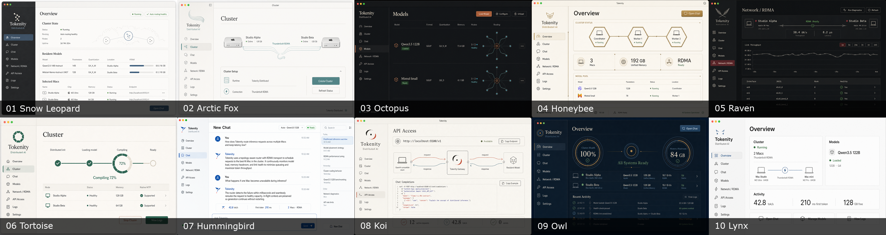

# Tokenity UI Concepts

Generated with the built-in ImageGen workflow on 2026-07-26 after reviewing
Tokenity's SwiftUI navigation, theme, chat workspace, onboarding, and current
distributed-inference feature set.

## Directions

| # | Direction | Animal device | Primary screen | Design character |
|---|---|---|---|---|
| 01 | Snow Leopard Graphite | Connected spots | Overview | Mature, editorial, production-oriented |
| 02 | Arctic Fox Ivory | Flowing tail line | Cluster | Light, quiet, approachable |
| 03 | Octopus Ink | Eight-arm routing graph | Models | Dark, technical, topology-first |
| 04 | Honeybee Brass | Hexagonal worker cells | Overview | Structured, warm, highly distinctive |
| 05 | Raven Ledger | Feather-line telemetry | Network / RDMA | Diagnostic, precise, operator-focused |
| 06 | Tortoise Jade | Segmented shell ring | Cluster startup | Stable, calm, progress-oriented |
| 07 | Hummingbird Cobalt | Angular wing mark | Chat | Fast, crisp, conversation-first |
| 08 | Koi Sumi | Paired request/response curves | API Access | Flowing, restrained, developer-focused |
| 09 | Owl Observatory | Concentric status rings | Overview | Watchful, premium, dark monitoring |
| 10 | Lynx Alpine | Ear strokes and endpoint dots | Overview | Reductionist, closest to direct implementation |

## Suggested shortlist

- **01 Snow Leopard Graphite** for the strongest all-round brand and product
  direction.
- **07 Hummingbird Cobalt** for the clearest Chat-first experience.
- **10 Lynx Alpine** for the lowest-risk SwiftUI implementation path.
- Borrow **03 Octopus Ink's** routing visualization and **06 Tortoise Jade's**
  readiness progress even if another direction becomes the base theme.

These are concept images, not pixel-accurate implementation specifications.
Labels and metrics should use the app's real data model when translated into
SwiftUI.

The shared generation constraints and per-direction prompts are recorded in
[PROMPTS.md](PROMPTS.md).
