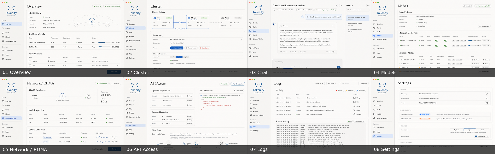

# Tokenity UI Page Designs — Light Graphite / Lynx

This suite was generated after launching the current
`TokenityControl-Stable.app` on `feature/auto-model-router` and rendering every
primary SwiftUI page from the current working tree.

## Direction

- Preserve the classic editorial restraint of the original Snow Leopard
  Graphite concept.
- Use a warm pale-stone sidebar in light mode instead of a black sidebar, so the
  visual distinction from dark mode remains immediate.
- Use the supplied Tokenity logo language: two angular alpine-blue ear strokes
  above two circular endpoint dots.
- Keep the product recognizably native to macOS and implementable in SwiftUI:
  compact information density, hairline rules, modest radii, quiet status pills,
  and minimal shadow.

## Pages

| # | Page | Design |
|---|---|---|
| 01 | Overview | [01-overview.png](01-overview.png) |
| 02 | Cluster | [02-cluster.png](02-cluster.png) |
| 03 | Chat | [03-chat.png](03-chat.png) |
| 04 | Models | [04-models.png](04-models.png) |
| 05 | Network / RDMA | [05-network-rdma.png](05-network-rdma.png) |
| 06 | API Access | [06-api-access.png](06-api-access.png) |
| 07 | Logs | [07-logs.png](07-logs.png) |
| 08 | Settings | [08-settings.png](08-settings.png) |

## Implementation tokens

| Role | Suggested value |
|---|---|
| Window background | `#F7F5F0` |
| Light sidebar | `#ECEAE4` |
| Primary graphite | `#25272A` |
| Alpine blue | `#315F8D` |
| Success green | `#53765B` |
| Corner radius | `8–10 px` |
| Separators | `1 px`, low-contrast warm grey |

The actual current-page renders used as layout references are retained under
[`references/current-ui`](references/current-ui). The supplied logo reference
is retained as
[`references/tokenity-lynx-logo-reference.png`](references/tokenity-lynx-logo-reference.png).

The shared ImageGen specification and page-specific prompt set are recorded in
[PROMPTS.md](PROMPTS.md).
