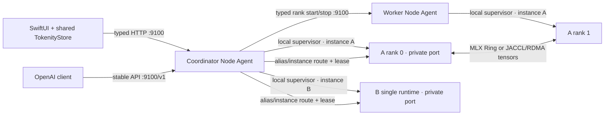

# Tokenity stability, streaming, and multi-instance audit — 2026-07-17

## Scope and evidence boundary

All builds, edits, and tests in this audit use
`/path/to/Tokenity-Stable`. The oMLX and exo trees under
`/path/to/MLX-Distributed` were read-only design references. The
remote Macs were inspected through Node Agent HTTP first. SSH was used only to
read versions, interface state, process/log details, and file hashes; no remote
file, process, Agent, runtime, or model was changed.

The remote Agents still run a pre-upgrade deployment. Consequently this report
separates local automated proof from post-deployment hardware proof. A failed
preflight or missing benchmark is never presented as a pass.

The final local baseline completed with 80 Python tests passed and 8 skipped,
plus 76 Swift tests passed. It built the collision-proof development bundle at
`apps/TokenityControl/.build/arm64-apple-macosx/debug/TokenityControl-Stable.app`
with bundle identifier `ai.tokenity.control.stable`. The Swift visual smoke test
rendered 2400×1600 light and dark Chat workspaces. Live Computer Use could not
capture a CGWindow in this desktop session; a read-only VS Code control capture
also timed out, so live click-through is not claimed as passed.

During the first UI-automation attempt, resolving the shared display name and
old bundle identifier briefly launched the prototype under
`/path/to/MLX-Distributed`. It was terminated immediately by exact
PID without interaction. All subsequent launches used the stable script and
full stable path. The new stable-only bundle identifier and bundle filename
remove that collision for future runs; this audit does not claim that the
original “never launch the old UI” condition was met perfectly.

## Root causes and fixes

| Area | Reproduced evidence and root cause | Implemented correction | Regression proof |
| --- | --- | --- | --- |
| First chat stream | Mac B's historical runtime log shows `StreamingResponse` had already begun when `_begin_generation` raised `RuntimeError: Loading model across MLX ranks`. Loading/materialization and failure therefore occurred inside the response body rather than before READY. The Swift client also treated any early stream error as permission to retry non-streaming. | Materialize weights and run a cancellable, deadline-bound, isolated one-token warmup before READY. Commit SSE headers immediately, emit legal comments during blocked prefill/compile work, record accepted/headers/keepalive/prefill/first-content/last/completed times, and only retry/fallback for `URLError`/`NSURLErrorDomain`. | Timestamped incremental SSE test, keepalive test, malformed-SSE no-fallback Swift test, and Content-Type enforcement. |
| False Loaded/green | Runtime phase could become ready when a provider object existed; `/v1/models`, a visible process, or background discovery could set the UI to Loaded without rank quorum or inference evidence. Poll errors could leave that state green. | Atomic per-rank status, canonical lifecycle, model/operation/instance/revision/topology identity, tokenizer and generation-engine evidence, rank quorum, one-token probe, and stale heartbeat rejection. External discovery stays Loading until verified warmup evidence. Load failure remains Failed. | Lifecycle/stale tests, quorum mismatch tests, external-process false-green test, failed-load Store tests, MenuBar topology tests. |
| Single Mac deadlock | The shared MLX-LM server provider calls `mx.distributed.init()` even for world size one. The previous single-node plan reused distributed environment and provider assumptions. | A first-class `execution_mode=single` path calls `mlx_lm.load(..., lazy=True)` and `stream_generate` directly. It creates no hostfile, rank endpoint, JACCL variables, MLX rank, or distributed group. | Static source test plus single-plan command/environment test. |
| Menu status drift | Main window and menu previously had opportunities to derive lifecycle independently; a discovered service could be adopted as Loaded. | One AppDelegate-owned `TokenityStore` feeds Models, Chat, Overview, and MenuBar. Green requires backend READY, loaded model, online ranks, and matching world size/connection mode. Failed/degraded states clear green. | Shared-store, topology, offline-node, external-stop, and visual smoke tests. |
| Misleading memory | Node Agent system `vm_stat` described system pages, not the rank process or MLX allocations. File-backed model pages were mixed with non-reclaimable usage. | Runtime/rank samples RSS, macOS `phys_footprint`, MLX active/peak/cache, one-copy weight estimate, observed resident allocation, prompt/KV availability, request count, sample time, and stale state. Agent returns per-rank values and a non-duplicated instance aggregate; system in-use and reclaimable file cache remain separate. | Memory accounting unit tests, stale runtime status test, Swift stale-label test, and per-rank DTO decoding. |
| Instance collisions | Supervisor identity was a global role, the Agent owned one runtime port/lease, and stop paths could reap every same-role process. | `ModelInstance`, legal transitions/versioning, `(role, instance_id)` supervision, dynamic port reservation, memory admission, per-instance heartbeat/status/log path, idempotent operation IDs, request leases, and precise stop. | Same-role isolation, resource/port admission, idempotency, lease, two-instance gateway, and Swift sibling-unload tests. |
| Product SSH path | Callable legacy launcher/hostfile helpers could reintroduce `mlx.launch`/SSH orchestration. | Production launcher entry points fail closed, hostfile DTOs contain data-plane addresses only, and all remote rank lifecycle uses typed Agent HTTP. The legacy endpoint returns 410. | Static source scan and launcher/hostfile/Agent schema tests. |

## Control plane, data plane, instances, and gateway



The gateway chooses an exact `instance_id` when requested; otherwise it uses
deterministic round-robin over READY/BUSY instances with the requested alias.
`X-Tokenity-Instance-ID` exposes the choice. The lease is released in the body
iterator's `finally`, including client disconnect/cancellation. Unload returns
409 while a lease is active.

## State and API compatibility

The backend instance lifecycle is:

`discovered → available → queued → launching → distributed_initializing or loading_metadata → materializing_weights → compiling_warming → ready ↔ busy → unloading → stopped`, with `failed` and `orphaned` side states.

The existing runtime `phase` values remain for older clients. A canonical
`lifecycle_state` and optional identity/evidence/memory fields are additive.
Existing start/stop endpoints remain; precise instance endpoints and the stable
gateway are additive. The legacy SSH-backed official endpoint remains present
but permanently returns HTTP 410. A restarted Agent does not silently kill a
process it cannot verify: it reports the process as orphaned.

## Performance work and decision record

The repository now includes `scripts/benchmark-openai-stream.py`. It records
headers latency, first SSE byte, first content TTFT, total time, exact usage
when supplied, prefill/decode rate, inter-content p50/p95/p99, server timeline,
and routed instance. It disables environment proxies and writes structured JSON.

No post-change hardware inference benchmark is claimed in this audit. At the
time of the final read-only check both remote model services were stopped, and
the deployed Agents lacked the new code/model revision fields. Historical logs
contain a 2.485 s worker-rank materialization sample, but it is not a controlled
before/after result and is not used as a speedup claim.

| Technique | Decision for this change | Apple Silicon / MLX rationale |
| --- | --- | --- |
| Materialization + compile warmup | Adopted for correctness, measured separately from readiness | MLX compilation happens on first invocation; moving it before READY removes user-visible cold compile without claiming lower total cold-start time. |
| Persistent runtime | Adopted per instance | Avoids repeated weight materialization and preserves independently bounded prompt caches. |
| MLX-LM response generator/concurrency | Retained and exposed through configuration | Uses the installed, version-pinned MLX-LM implementation rather than a forked scheduler. |
| Prompt/prefix cache | Retained with bounded entries | Official MLX-LM documents prompt caching; the warmup cache is replaced so it cannot pollute user state. |
| Chunked prefill | Existing configurable `prefill_step_size` retained | Useful for long prompts, but decode-priority scheduling needs controlled concurrency measurements before a default change. |
| Native MTP/speculative decoding | Kept behind off/auto/required capability checks | Speculation can preserve the target distribution, but benefit depends on acceptance and extra memory; unsupported/random draft heads are rejected. |
| Paged/block KV and KV quantization | Deferred | PagedAttention's results target CUDA/GPU allocators. MLX uses unified memory and model-specific cache kernels; no silent approximation enters the default path. |
| Prefill/decode disaggregation | Deferred | DistServe/Splitwise assume extra replicas and cheap KV transfer. With two Macs and a model that already needs both memories, this can reduce capacity or add transfer latency. |
| Custom Metal kernels | Deferred | Requires model-specific correctness and same-token benchmarks; no evidence currently justifies a default fork. |

Primary references used for these decisions:

- [MLX distributed communication](https://ml-explore.github.io/mlx/build/html/usage/distributed.html)
- [MLX compilation](https://ml-explore.github.io/mlx/build/html/usage/compile.html)
- [Official MLX-LM repository and long-prompt/cache guidance](https://github.com/ml-explore/mlx-lm)
- [PagedAttention / vLLM paper](https://arxiv.org/abs/2309.06180)
- [Sarathi-Serve chunked-prefill paper](https://arxiv.org/abs/2403.02310)
- [DistServe OSDI 2024 paper](https://www.usenix.org/system/files/osdi24-zhong-yinmin.pdf)
- [Splitwise paper](https://arxiv.org/abs/2311.18677)
- [Speculative decoding paper](https://arxiv.org/abs/2211.17192)
- [Speculative sampling paper](https://arxiv.org/abs/2302.01318)

## Reproducible commands

```bash
cd /path/to/Tokenity-Stable

# Read-only A/B runtime, version, model revision, and RDMA preflight
.venv/bin/python scripts/preflight-tokenity-cluster.py \
  --output /tmp/tokenity-preflight.json

# Direct private runtime benchmark (includes readiness timeline)
.venv/bin/python scripts/benchmark-openai-stream.py \
  --base-url http://<node-a-lan-ip>:8000/v1 \
  --model Qwen3.5-122B-A10B-4bit \
  --repeats 5 --concurrency 1 --max-tokens 128 \
  --label qwen-single-cold-or-warm \
  --output /tmp/qwen-single.json

# Stable gateway and load-balancing benchmark
.venv/bin/python scripts/benchmark-openai-stream.py \
  --base-url http://<node-a-lan-ip>:9100/v1 \
  --model Qwen3.5-122B-A10B-4bit \
  --repeats 8 --concurrency 2 --max-tokens 128 \
  --label qwen-gateway-c2 \
  --output /tmp/qwen-gateway-c2.json

./scripts/verify-stable-baseline.sh
```

For an incremental wire check, use `curl -N --no-buffer` against the stable
gateway and prefix output with a timestamping reader. SSE lines beginning with
`:` are keepalive evidence, not content tokens.

## Current A/B preflight and hardware status

The 2026-07-17 read-only HTTP preflight confirmed:

- Mac A: LAN `<node-a-lan-ip>`, active `rdma_en4`, RDMA IP `<node-a-rdma-ip>`.
- Mac B: LAN `<node-b-lan-ip>`, active `rdma_en5`, RDMA IP `<node-b-rdma-ip>`.
- Both: runtime Python `${TOKENITY_RUNTIME_PYTHON}`,
  `mlx 0.31.2`, `mlx-lm 0.31.3`, and matching Qwen inventory size.
- Read-only SSH hashing additionally found the same `config.json` and
  `model.safetensors.index.json` hashes on both machines.

The new strict preflight correctly failed overall because the currently
deployed Agents do not yet return `tokenity_code_revision` or inventory
`revision`. This is a deployment/version block, not an inference pass.

| Hardware scenario | Status |
| --- | --- |
| A single, B single, first/second stream, memory release | Waiting for deployment and hardware validation |
| A+B Ring | Waiting for deployment and hardware validation |
| A+B JACCL/RDMA Qwen | Waiting for deployment and hardware validation |
| Distributed GLM plus A single Qwen | Automated isolation/routing proven; real memory admission and generation waiting for hardware validation |
| Worker crash, RDMA break, sleep/wake, Agent restart | Automated failure/state pieces proven; end-to-end hardware fault injection waiting for deployment |

## SSH audit record

SSH was used with batch mode only after HTTP was insufficient to prove local
file/interface facts. The read-only operations were hostname checks, package
version reads, `ifconfig`/RDMA interface reads, process/log inspection, and
SHA-256 calculation for Agent/runtime/model metadata on:

- `<node-a-user>@<node-a-lan-ip>`
- `<node-b-user>@<node-b-lan-ip>`

No SSH start, stop, copy, deployment, model mutation, or configuration command
was run. No SSH credential or command is present in the product launch chain.

## Known limits and rollback controls

- Remote shared code has not been deployed by this audit. Real hardware items
  stay blocked until an explicit deployment step is authorized.
- Live Computer Use window interaction remains unverified because the desktop
  capture service could not capture Tokenity or its control application; the
  deterministic Swift view render and interaction/state tests did pass.
- Gateway authentication/TLS is not included; port 9100 must remain on a trusted
  local network.
- The in-memory instance registry reports pre-Agent processes as orphaned after
  restart; automatic adoption of a non-child process remains intentionally
  conservative.
- Use `native_mtp.mode=off` to disable speculation, Standard Network/Ring to
  bypass JACCL, and `TOKENITY_MLX_LOAD_POLICY=fixed` to restore conservative
  materialization chunking. These do not restore any SSH orchestration.
